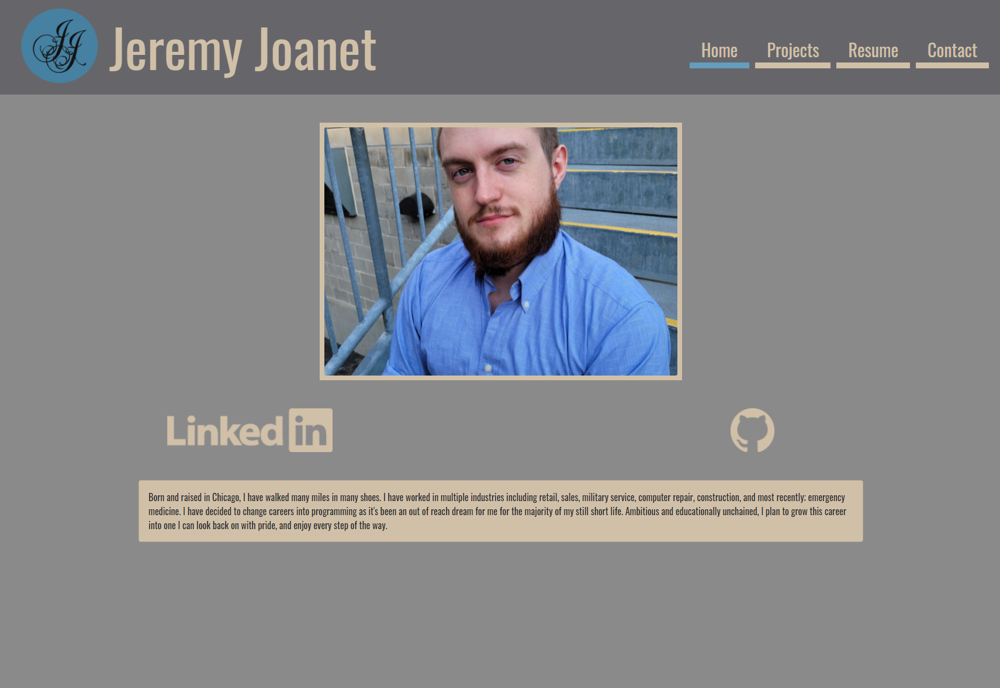

## Live Deploy
https://jjj-portfolio.herokuapp.com/Resume

# Updated Portfolio

# Contact
Github:
Vygoth

Email:
JeremyJoanet@protonmail.com

## Description
I built this to not only reimagine my portfolio, but to also build it using React as a foundation. Porfolio 2.0 is not only more visually appealing and less distracting, its also faster, more organized, and includes better functionality. Featuring a home section with a pic, bio, and github / linkedin links, a project section featuring a mapped array of some of my github projects and associated links, a resume section with my resume, and a contact page that includes not only my contact information, but a functional contact form that emails me with user submissions(which is broken on heroku, thanks heroku).

## Table of Contents
- [Usage](#Usage)
- [Credits](#Credits)
- [Screenshot](#Screenshot)

## Usage
Simply navigate to the deployed heroku site for easy access.

## Screenshot

